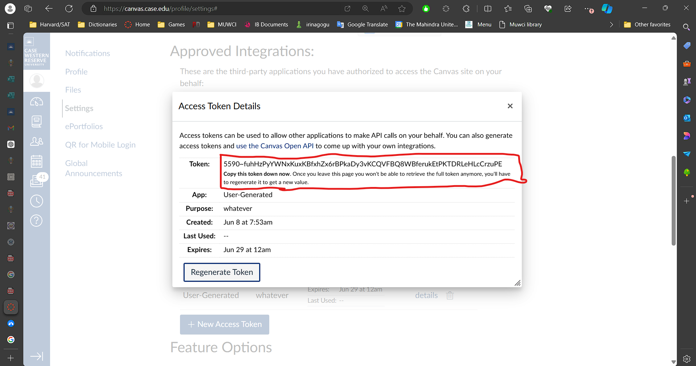

# 📂 Canvas Module Downloader

**Canvas Module Downloader** is a Python script that helps you download course materials from the Canvas LMS. This tool fetches files from your courses and modules, saves them in organized directories, and tracks downloaded modules to avoid re-downloading them. The script uses the Canvas API to interact with the courses and modules.

---

## 🚀 Features

- **Course and Module Downloading:** Downloads all available files from courses and modules.
- **Track Downloaded Modules:** Keeps track of modules that have already been downloaded to prevent duplicates.
- **Customizable Directory Structure:** Automatically creates directories for each course and module.
- **Error Logging:** Provides detailed logs of download progress and errors.

---

## ⚙️ Installation

### Prerequisites

- **Python 3.x** is required.
- You will need to install the following Python packages:
  - `requests`
  - `re`
  - `os`
  
You can install the required dependencies using `pip`:
```bash
pip install requests
Clone the repository

git clone https://github.com/yourusername/CanvasModuleDownloader.git
cd CanvasModuleDownloader
```
### 🛠 Configuration
Before running the script, you will need to configure the following parameters:

Canvas Domain: Update the canvas_domain variable to your Canvas domain (e.g., "canvas.case.edu").  

Access Token: Replace the access_token with your Canvas API token. Ensure the token has the necessary permissions to access course modules and files.  

Output Directory: The output_dir specifies where downloaded files will be saved. The default is ./canvas_downloads.  


### How to get your Canvas Access Tocken



### 🎮 Usage
To start downloading materials from your Canvas courses:

Run the script:

```bash
python canvas_downloader.py
```
The script will fetch all available courses, modules, and their associated files, then download them into respective directories under the output_dir folder.

### How it Works
The script fetches the list of courses using the Canvas API.
For each course, it checks for available modules and their items (files).
It then downloads the files and organizes them by course and module in the specified output directory.
Once a module is downloaded, it is tracked in the downloaded_modules.txt file to avoid duplicate downloads in future runs.
### 🔧 Functions in the Script
get_courses()
Fetches the list of courses the user is enrolled in from Canvas.

get_course(course_id)
Fetches details of a specific course.

get_course_modules(course_id)
Retrieves all modules for a given course.

get_module_items(course_id, module_id)
Fetches all items (files) within a specific module.

download_file(file_url, output_path)
Downloads a file from a given URL and saves it to the specified output path.

is_module_downloaded(module_id)
Checks if a module has already been downloaded by checking the downloaded_modules.txt file.

mark_module_as_downloaded(module_id)
Marks a module as downloaded by appending its ID to the downloaded_modules.txt file.

sanitize_directory_name(name)
Sanitizes directory names by replacing special characters with underscores.

download_all_courses_files()
The main function that downloads all files for all courses.

### 📝 Logging
The script uses Python’s built-in logging module to track and report progress. The logs will display information on:

Courses being processed
Modules being downloaded
Errors encountered during downloads
Log messages are printed to the console and can be modified to save to a file if needed.

### ⚠️ Error Handling
If an error occurs (such as an HTTP error or a missing file), the script logs the error and continues with the next available course/module. The detailed error messages will help identify and troubleshoot any issues.

### 🏁 Running the Script
Update your access_token and canvas_domain in the script.
Run the script using:
```bash

python canvas_downloader.py
```
Check the ./canvas_downloads directory for the downloaded materials.
### 📄 License
This project is licensed under the MIT License - see the LICENSE file for details.

### 🌟 Enjoy downloading your Canvas course materials! 🚀
